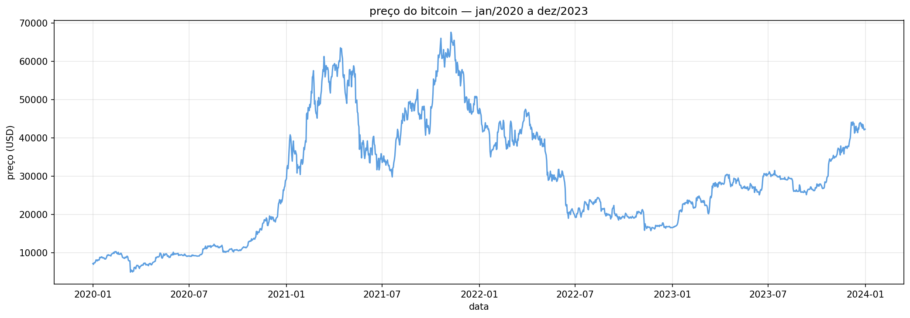
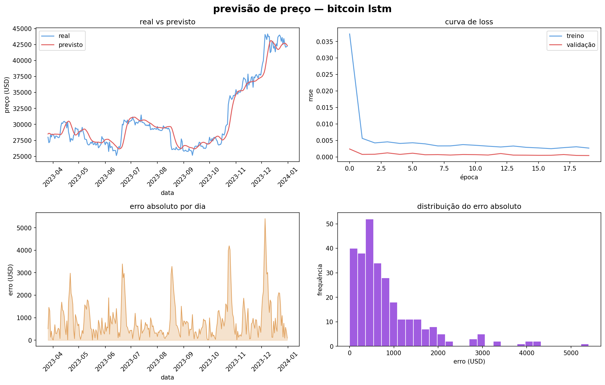

# 📈 Previsão de Séries Temporais — Bitcoin LSTM

Modelo LSTM para prever o preço do Bitcoin usando 60 dias de histórico como janela de entrada, com dados reais coletados via Yahoo Finance.

> ⚡ Ative a GPU no Colab: **Runtime > Change runtime type > GPU**

## Como foi feito

Os preços diários de fechamento do Bitcoin foram coletados via yfinance de janeiro/2020 a dezembro/2023. Os dados foram normalizados com MinMaxScaler e transformados em sequências de 60 dias — o modelo usa os últimos 60 dias para prever o próximo preço. A LSTM é uma rede neural especializada em sequências, capaz de capturar dependências de longo prazo nos dados.

## Base de dados

Preços reais do Bitcoin coletados via Yahoo Finance:

| Dado | Valor |
|---|---|
| Período | Jan/2020 — Dez/2023 |
| Total de dias | 1.461 |
| Janela de entrada | 60 dias |
| Treino | 1.120 sequências |
| Teste | 281 sequências |

## Arquitetura

| Camada | Detalhe |
|---|---|
| LSTM 50 | return_sequences=True |
| Dropout 0.2 | regularização |
| LSTM 50 | return_sequences=False |
| Dropout 0.2 | regularização |
| Dense 25 | relu |
| Dense 1 | saída — preço previsto |

## Resultados

| Métrica | Valor |
|---|---|
| MAE | $898 |
| RMSE | $1.272 |
| Val Loss final | 3.97e-04 |

Erro médio de $898 sobre um ativo que oscila entre $20k e $65k representa menos de 3% de erro relativo.

## Tecnologias

- Python 3
- TensorFlow / Keras — arquitetura LSTM
- yfinance — coleta de dados reais do Bitcoin
- scikit-learn — normalização MinMaxScaler
- matplotlib — visualizações

## Como rodar

1. Ative a GPU: **Runtime > Change runtime type > GPU**
2. Clique no badge **Open in Colab** acima
3. Vá em `Runtime > Run all`
4. Os dados são coletados automaticamente via yfinance

## Resultados visuais

### Série histórica

### Previsão vs Real

